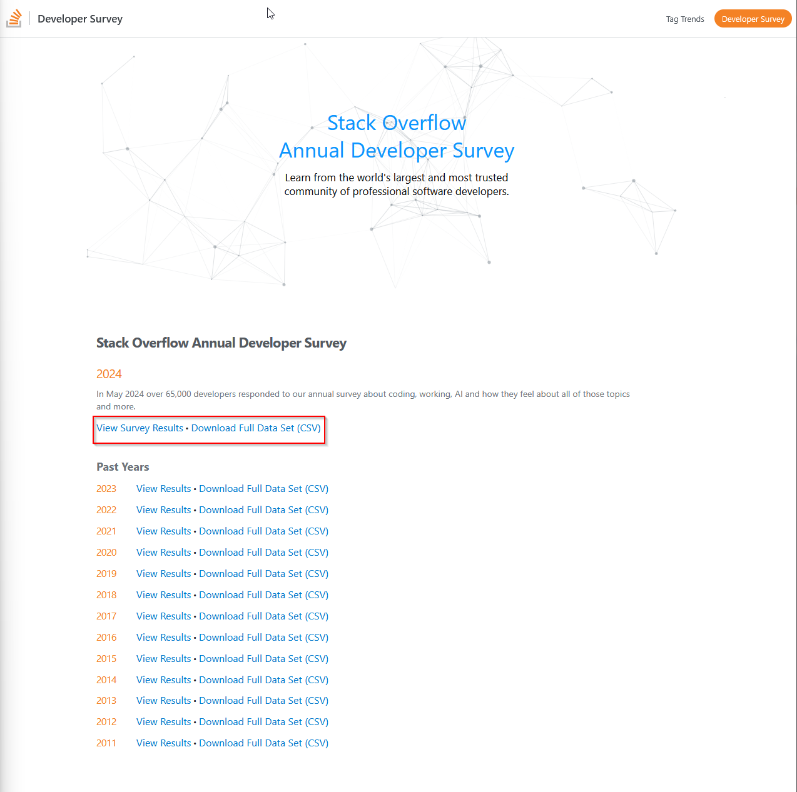
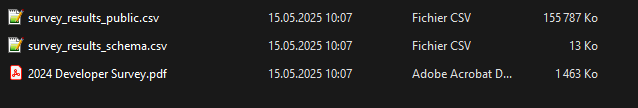
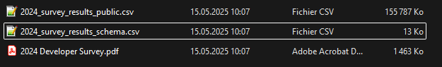
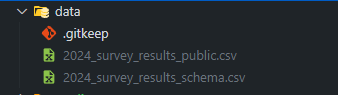

# ML_Engineer_Challenge

Welcome to the Machine Learning Challenge!
This project aims to predict a developer's salary and suggest changes to potentially increase their salary based on the Stack Overflow Developer Survey data.

## Table of Contents

- [ML\_Engineer\_Challenge](#ml_engineer_challenge)
  - [Table of Contents](#table-of-contents)
  - [Setup Instructions](#setup-instructions)
    - [Prerequisites](#prerequisites)
    - [Setting Up the Virtual Environment](#setting-up-the-virtual-environment)
    - [Data download](#data-download)
  - [Project Structure](#project-structure)
  - [Usage](#usage)
  - [License](#license)

## Setup Instructions

### Prerequisites

- Python 3.8 or higher
- pip (Python package installer)

### Setting Up the Virtual Environment

1. **Clone the Repository:**

   ```bash
   git clone https://github.com/LeoSchirvanian/ML_Engineer_Challenge
   cd ML_Engineer_Challenge
   ```

    Create a Virtual Environment:

    ```python
    py -m venv venv
    ```

Activate the Virtual Environment:

- On Windows:

    ```powershell
    venv\Scripts\activate
    ```

- On macOS/Linux:

    ```bash
    source venv/bin/activate
    ```

Install Required Packages:

```python
pip install -r requirements.txt
```

The requirements.txt file should include all necessary Python packages, such as pandas, numpy, matplotlib, seaborn, and scikit-learn.

### Data download

Due to Git file size constraints, the survey data cannot be stored and tracked with Git.
To tackle this problem, each user who wants to contribute to this repository needs to download and place the dataset locally.
Please find below all required steps:

1. Visit the Stack Overflow Developer Survey [website](survey.stackoverflow.co).
2. Download datasets for the desired year(s), for this repository we will select the year 2024.
   
3. Once downloaded unzip the folder and rename it with the year prefix (here "2024_")
   
   
4. Place datasets in the data folder

   

## Project Structure

project-directory/
│
├── data/                  # Directory to store the dataset
│   └── survey_results_public.csv  # Example dataset file
│
├── notebooks/             # Jupyter notebooks for analysis
│   └── exploratory_analysis.ipynb
│
├── scripts/               # Python scripts for data processing and modeling
│   ├── data_cleaning.py
│   ├── feature_engineering.py
│   ├── model_training.py
│   └── model_serving.py
│
├── requirements.txt       # Python package dependencies
│
└── README.md              # Project README file

## Usage

Exploratory Data Analysis (EDA):
    Open the Jupyter notebook notebooks/exploratory_analysis.ipynb to perform EDA on the dataset.

Data Cleaning and Feature Engineering:
    Run the scripts/data_cleaning.py script to clean the dataset.
    Run the scripts/feature_engineering.py script to engineer features.

Model Training:
    Run the scripts/model_training.py script to train the predictive model.

Model Serving:
    Run the scripts/model_serving.py script to serve the model for predictions.

## License

This project is licensed under the MIT License. See the LICENSE file for details.
